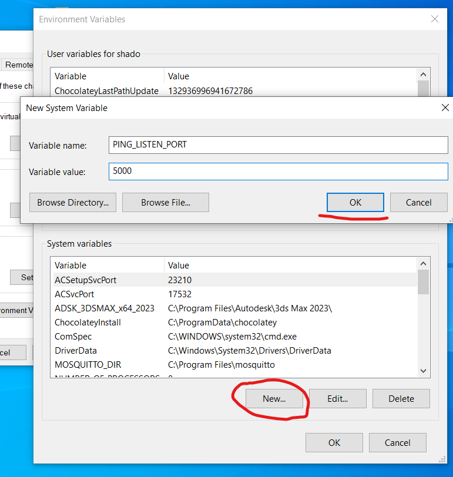

# WIK-DPS-TP01 : 

- Author : Théo Feugnet
- Description : A simple webserver which send back the header of a request when we use the path "/ping"

# How to use :
  1.  Be sure to install node.js to your computer. https://nodejs.org

  2. Setup the environment variable "PING_LISTEN_PORT"
- For linux and mac use this console command : 
  > export PING_LISTEN_PORT={port}  
  
- For windows, search in your "environment variables"
  
Then click on "Environment variables..."

  Finally create a new variable named "PING_LISTEN_PORT" with the wanted port as a value  

3. At project route run in a terminal : 
   > npx ts-node src/index.ts

4. Now open a browser and search for :   
  >  http://localhost:{PING_LISTEN_PORT}/ping    

  or use the command :   
    
  > curl localhost:{PING_LISTEN_PORT}/ping -v

You will get the json file of the headers of your request on your browser's page or terminal.  

If the route is wrong you will get a simple response with 404 status code.

# For docker : 

- Install docker if already not done. We advise you to use also docker desktop to have a good view of what is happening with your containers and images
- Get into the cloned repository :
- To build the first image use : 
  > docker build -t [nameofyourimage] -f Dockerfile.1 .
- To build the second image use : 
  > docker build -t [nameofyourimage] -f Dockerfile.2 .
- To run the image use :
  > docker run -it --rm -p [ThePortYouWantToUse]:[ThePortYouWantToUse] -e PING_LISTEN_PORT=[ThePortYouWantToUse] [nameofyourimage]

